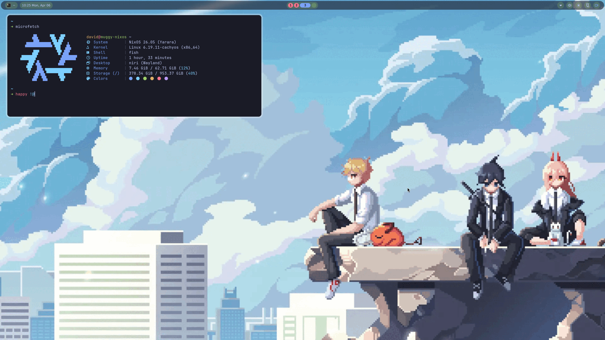

# ❄️ NixOS Configuration


[](https://github.com/chandrahmuki/nixos-config/stargazers)
[](https://github.com/chandrahmuki/nixos-config/network/members)

## Screenshots

[](.github/assets/screenshot.png)

[More screenshots](#)

## Table of Contents

- [Installation](#installation)
- [Usage](#usage)
  - [Managing Hosts](#managing-hosts)
  - [Rebuilding](#rebuilding)
  - [Rollbacks](#rollbacks)
- [Credits](#creditsinspiration)

## Installation

> [!NOTE]
> Before proceeding with the installation, check these files and adjust them for your system:
> - `hosts/Default/variables.nix`: Contains host-specific variables.
> - `hosts/Default/host-packages.nix`: Lists installed packages for the host.
> - `hosts/Default/configuration.nix`: Module imports for the host and extra configuration.

You can install on a running system or from the NixOS live installer. Get the minimal ISO from the [NixOS website](https://nixos.org/download/#nixos-iso).

### Installation Steps

1. Clone the Repository:
   ```bash
   git clone https://github.com/chandrahmuki/nixos-config.git ~/nixos-config
   ```

2. Change Directory:
   ```bash
   cd ~/nixos-config
   ```

3. Run the Installer:
   ```bash
   ./install.sh
   ```

The install script automates the setup process, including hosts, username, and applying the configuration.

## Usage

### Managing Hosts

**Method 1: Automatic** - run the installer again to select or create another host:
```bash
./install.sh
```

**Method 2: Manual:**
1. Copy `hosts/Default` to a new directory (e.g., `hosts/Laptop`)
2. Edit the new host's `variables.nix` and `host-packages.nix`
3. Add the host to `flake.nix`:
   ```nix
   nixosConfigurations = {
     Default = mkHost "Default";
     Laptop = mkHost "Laptop";
   };
   ```
4. Track the new host with git:
   ```bash
   git add hosts/Laptop
   ```
5. Rebuild with the new hostname using either `nixos-rebuild` or `nh`.

### Rebuilding

Apply configuration changes:
- **Command:** `nos` (alias for `nh os switch`)
- **nixos-rebuild:** `sudo nixos-rebuild switch --flake ~/nixos-config#<HOST>`
- **nh:** `nh os switch --hostname <HOST>`

### Rollbacks

- **List generations:** `list-gens`
- **Rollback:** `rollback N` (replace N with generation number)

## Credits/Inspiration

| Credit | Reason |
|--------|--------|
| [Sly-Harvey/NixOS](https://github.com/Sly-Harvey/NixOS) | Main inspiration for this config |
| [Niri](https://github.com/YaLTeR/niri) | Wayland compositor |
| [Noctalia](https://github.com/noctalia-dev/noctalia-shell) | Shell customization |
| [Home Manager](https://github.com/nix-community/home-manager) | User configuration management |
| [CachyOS Kernel](https://github.com/CachyOS/kernel-patches) | Optimized kernel |

## About

NixOS + Niri (Wayland compositor) + Home Manager configuration with gaming and productivity optimizations.

### Topics

linux nix nixos nixos-configuration flake home-manager niri

### License

[MIT License](LICENSE)