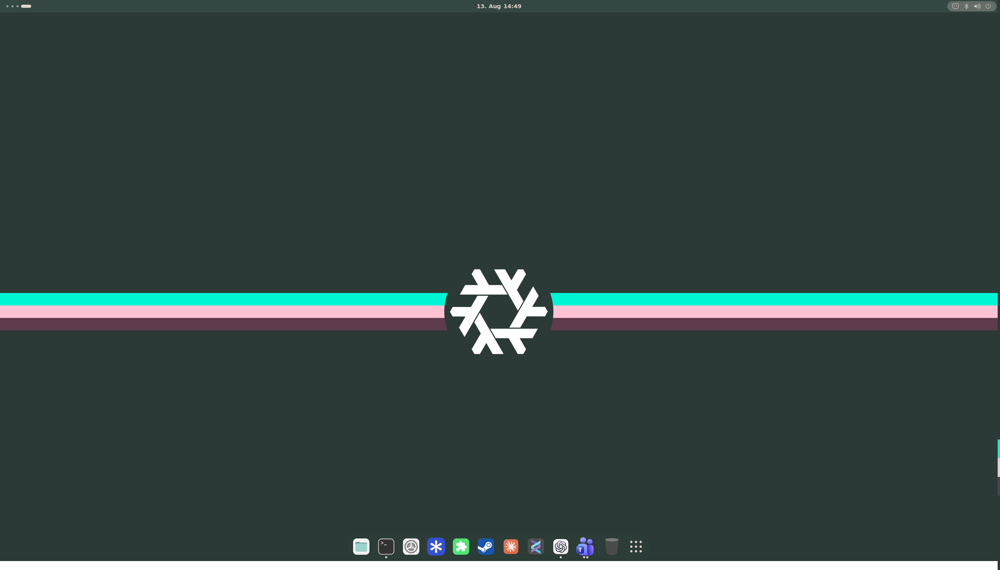

# NixOS Configuration

NixOS flake for a modern, high-performance GNOME desktop, built with Home Manager, [Den](https://github.com/denful/den) aspects, Stylix theming, and SOPS-Nix secret management.



---

## 🌟 Highlights

- **Modular Architecture**: Composable system & user aspects managed with `den` and `import-tree`.
- **Dual-Profile Structure**:
  - **`muggy-nixos`**: Primary personalized desktop configuration (Gaming, AI tooling, Media, SOPS).
  - **`generic` / `default`**: Portable, out-of-the-box profile for any machine without hardware lock-in.
- **Developer & AI Tooling**: Native integration for Antigravity CLI, OpenCode, Claude Desktop / Code, Codex, Herdr, and OmniGraph.
- **Fast Deployments**: Optimized deployment workflow using `nh` (`nos` command) with visual diffs.
- **Security & Privacy**: Secrets encrypted via Age/SOPS-Nix; AI workspace memories and sessions kept 100% local via `.gitignore`.

---

## 🚀 Quickstart & Installation

### Option 1: Install the Generic Template (New Machine / Other Users)

```sh
# 1. Clone the repository
git clone https://github.com/chandrahmuki/nixos-config.git ~/nixos-config
cd ~/nixos-config

# 2. Generate your machine's hardware configuration
sudo nixos-generate-config --show-hardware-config > hosts/system/hardware-configuration.nix

# 3. Check flake evaluation
nix flake check --no-build

# 4. Build and activate the generic configuration
sudo nixos-rebuild switch --flake .#generic
```

### Option 2: Daily Workflow (`muggy-nixos`)

Once installed, managing your system is fast and simple:

```sh
# Apply configuration changes
nos

# Update flake dependencies
nfu
```

---

## ⚙️ Customization (`settings.nix`)

Identity, locale, timezone, and active aspect profiles are defined centrally:

```nix
{
  username = "user";
  hostname = "nixos";
  system = "x86_64-linux";
  configDirectory = "/home/user/nixos-config";
  timeZone = "UTC";
  locale = "en_US.UTF-8";

  profiles = {
    desktop = [ "gnome" "neovim" "terminal" "theme" "utils" ... ];
    user = [ "git" "xdg" "yazi" ... ];
    personalDesktop = [ "ai" "gaming" "media" ... ];
    personalUser = [ "discord" "herdr" "zen-browser" ... ];
  };
}
```

---

## 📁 Repository Layout

```text
nixos-config/
├── aspects/                  # Modular NixOS and Home Manager aspects
│   ├── ai.nix                # AI tools (Antigravity, Claude, OpenCode, OmniGraph)
│   ├── gnome.nix             # Desktop environment and extensions
│   ├── herdr.nix             # Herdr workspace manager
│   ├── media.nix             # MPV, YT-DLP, Cliamp & playlists
│   ├── nh.nix                # Nix Helper (nos command)
│   ├── sops.nix              # SOPS-Nix encrypted secret management
│   ├── terminal.nix          # Fish, Foot, Starship, Zoxide
│   └── ...
├── assets/                   # Wallpapers, themes, and radio configurations
├── hosts/
│   ├── muggy-nixos/          # Personal workstation hardware & settings
│   └── system/               # Generic hardware template
├── secrets/                  # Encrypted SOPS secrets (secrets.yaml)
├── flake.nix                 # Flake inputs, outputs, and system definitions
├── home.nix                  # Home Manager base
└── settings.nix              # Base template settings
```

---

## 🔒 Secrets Management

Secrets are encrypted using [sops-nix](https://github.com/Mic92/sops-nix) with Age keys (`~/.ssh/id_ed25519`). Plaintext secrets never touch Git; only the encrypted `secrets.yaml` is tracked.

---

## 📄 License

[MIT License](LICENSE)
